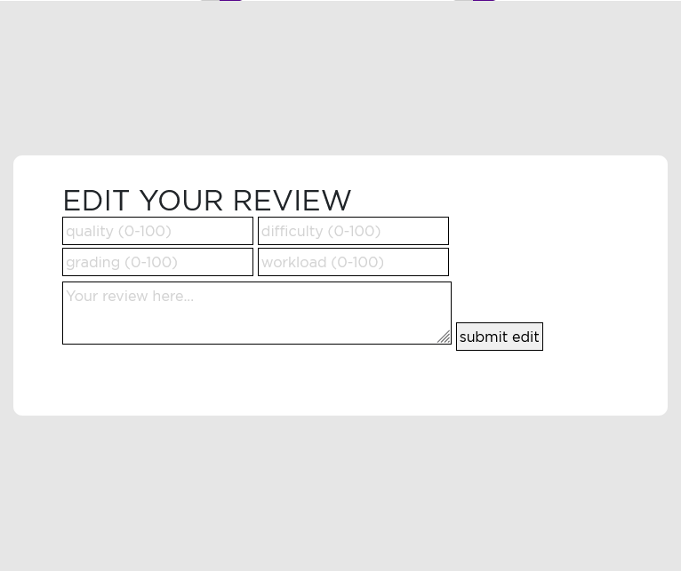
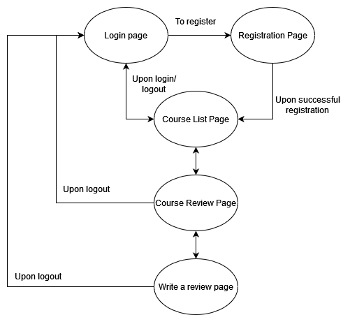

# NYUAD Course Review

## Overview

At NYU Abu Dhabi, selecting your courses for the upcoming semester is usually a very difficult task. It takes time and effort to search up potential courses that interest you and then search up reviews by scrolling and searching through years old posts on Facebook groups, asking your friends, or searching up on RateMyProfessor. Yet still sometimes students end up finding nothing.

NYUAD course review is a web app where students will be able to access all the courses that have been and are being taught at the Abu Dhabi campus of NYU and find reviews and ratings for any course. NYU students can register, login, read course reviews, and add or edit their own reviews on courses offered at NYUAD. This way the web app attempts to make the time taking task that students face every semester easy and centralized. 


## Data Model

The application will store course, course review, and user information.

* Each course will have its own categories/tags to facilitate filtering/search.
* Each course will have its own course reviews.
* Each course review for a course will have information about user, review text, ratings on certain metrics, and timestamp of the review post.
* Each user can have a single review on a course, and multiple reviews overall through references.

An Example Course:

```javascript
{
  name: 'Language of Computers',
  code: 'CADT-UH 1013EQ', //unique for each course based on university assigned codes
  level: 1000, //level of course
  program: ['CADT', 'E','Q'] //a list of different programs or categories the course falls under
  course_reviews: // a list of references to each course review document for the course
  average_ratings: { // an object with average of values for all rating metrics for the course
    Quality: 89,
    Difficulty: 78,
    Grading: 90,
    Workload: 86
  }
}
```

An Example User:

```javascript
{
  username: "hasin",
  email: 'mhs581@nyu.edu',
  password: // a password hash,
  reviews: // an array of references to course review documents by the user
}
```

An Example Course Review:

```javascript
{
  id: // a unique id for each course review
  course: //a reference to a course object,
  user: // a reference to a User object,
  review: {
    description: //a text based review of the course,
    quality: // a numerical rating for course quality metric,
    difficulty: // a numerical rating for course difficulty metric,
    grading: // a numerical rating for course grading metric,
    workload: // a numerical rating for course workload metric,
  },
  createdAt: // timestamp
}
```


## [Link to Commented First Draft Schema](db.js)

## Wireframes

/login - page for logging in. Every user needs to login to access content.


/register - page for registering as a user.


/course-list - page for showing all the courses


/course-list?<filter_params> - showing courses filtered according to query parameters


/review-page/:course-name - page for showing all the reviews for the selected course


/write-a-review/:course-name - page for writing a review for the selected course


/edit-review/:course-name - page for editing own review for the selected course



## Site map



## User Stories or Use Cases

1. as non-registered user, I can register a new account with the site using my nyu email
2. as a user, I can log in to the site
3. as a user, I can view and search in all of the course list
4. as a user, I can view all of the reviews posted for a course
5. as a user, I can write a review for a course
6. as a user, I can edit my review for a course
7. as a user, I can delete my review for a course

## Research Topics

* (4 points) Integrate user authentication
    * I'm going to be using Firebase Authentication (by Google) for user authentication
    * Firebase provides extensive options for user authentication including through SDKs and external APIs and integration of Federated Identity Providers (Facebook, Google login etc.)
    * Due to complexity of effectively managing user authentication through multiple platforms using Firebase, assigned it 4 points.
* (5 points) React.js (Front-end framework)
    * using the popular React.js as the frontend framework
    * will also research on application state management using React Hooks
    * will be using react-router-dom for front-end routing
    * since React requires understanding of more advanced concepts including libraries to be used as a supplement/complement, and is a challenging framework to learn, I have assigned it 5 points.
* (2 points) loadable-components (Javascript library)
    * To be used to import components into React dynamically and divide the entire web application into bundles/chunks
    * This will allow for serving only what is needed and not the entire content at once, helping in better web application performance/speed
* (2 points) Material-UI (Front-end library)
    * For provision of a customizable library of lightweight React components and icons that are ready to use and customize, and are robust.
    * Will assist in avoiding reinventing the wheel for very common components yet still allow for customization as needed.
* (2 points) Perform client-side form validation using Parsley.js
    * Parsley.js is a powerful library that allows for complex and dynamic form validation through extensive means.
    * Ability to override default parsley.js behaviour allows for customization of validation methods as needed
    * Useful for the project since it is based on multiple forms for which validation is a necessity

15 points total out of 8 required points 


## [Link to Initial Main Project File](server/app.js) 

## Annotations / References Used

1. [React Documentation](https://reactjs.org/docs/getting-started.html)
2. [Redux State Management Documentation](https://react-redux.js.org/tutorials/quick-start)
3. [Firebase Authentication Documentation](https://firebase.google.com/docs/auth)
4. [Documentation for loadable-components](https://loadable-components.com/docs/)
5. [Documentation for Material UI](https://mui.com/getting-started/usage/)
6. [Parsley form validation documentation](https://parsleyjs.org/doc/index.html)

