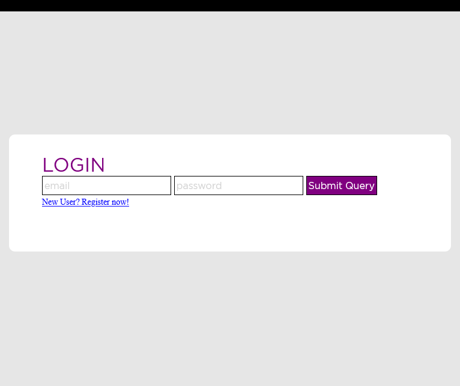
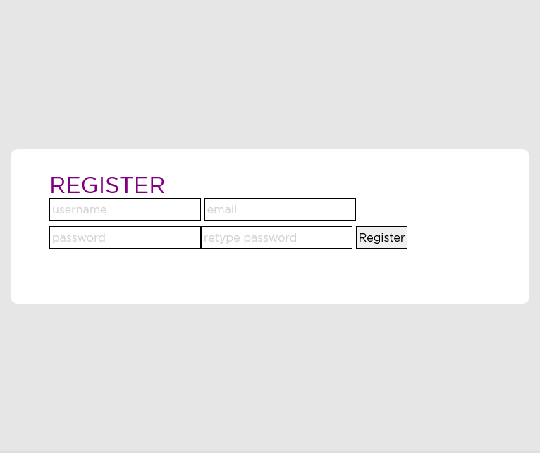
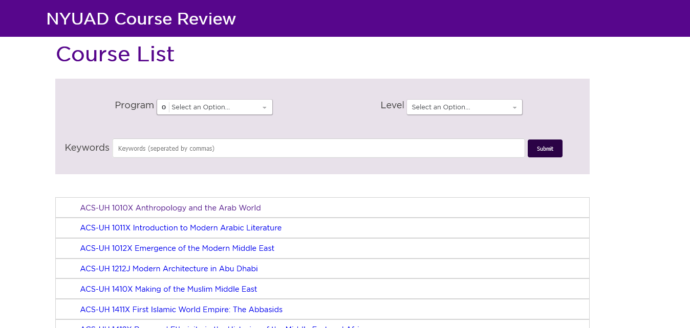
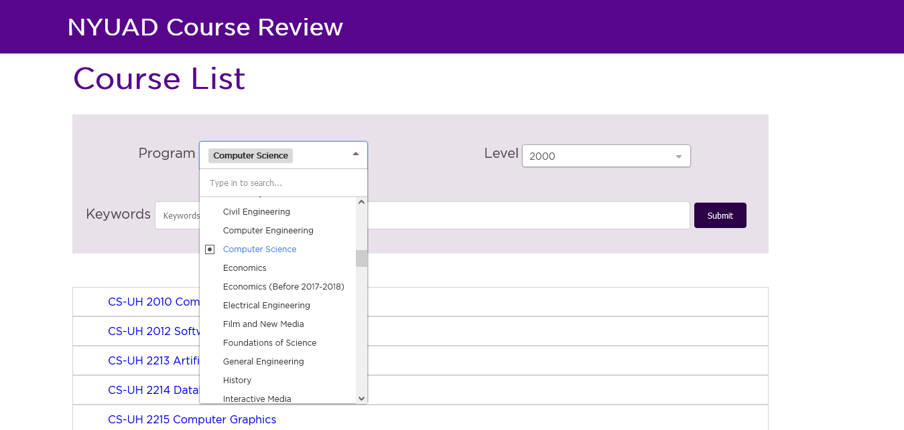
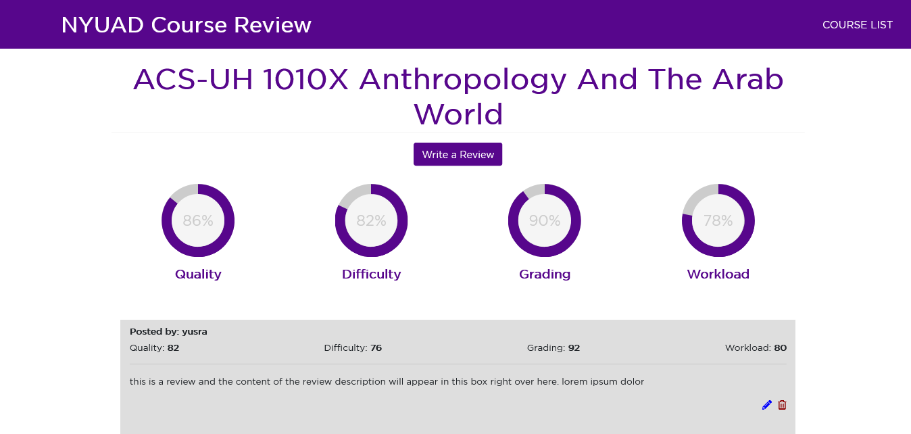
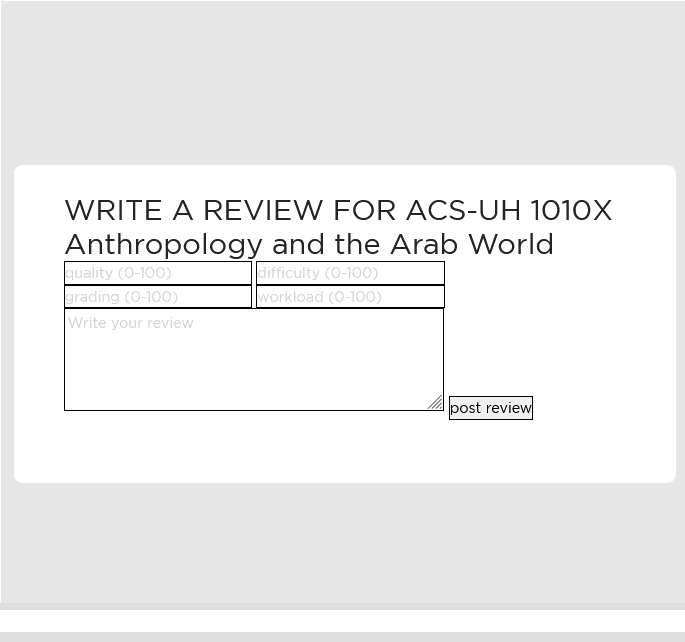

# NYUAD Course Review

## Overview

At NYU Abu Dhabi, selecting your courses for the upcoming semester is usually a very difficult task. It takes time and effort to search up potential courses that interest you and then search up reviews by scrolling and searching through years old posts on Facebook groups, asking your friends, or searching up on RateMyProfessor. Yet still sometimes students end up finding nothing.

NYUAD course review is a web app where students will be able to access all the courses that have been and are being taught at the Abu Dhabi campus of NYU and find reviews and ratings for any course. NYU students can register, login, read course reviews, and add or edit their own reviews on courses offered at NYUAD. This way the web app attempts to make the time taking task that students face every semester easy and centralized. 


## Data Model

The application will store course, course review, and user information.

* Each course will have its own categories/tags to facilitate filtering/search.
* Each course will have its own course reviews.
* Each course review for a course will have information about user, review text, ratings on certain metrics, and timestamp of the review post.
* Each user can have a single review on a course, and multiple reviews overall through references.

An Example Course:

```javascript
{
  name: 'Language of Computers',
  code: 'CADT-UH 1013EQ', //unique for each course based on university assigned codes
  level: 1000, //level of course
  program: ['CADT', 'E','Q'] //a list of different programs or categories the course falls under
  course_reviews: // a list of references to each course review document for the course
  average_ratings: { // an object with average of values for all rating metrics for the course
    Quality: 89,
    Difficulty: 78,
    Grading: 90,
    Workload: 86
  }
}
```

An Example User:

```javascript
{
  username: "hasin",
  email: 'mhs581@nyu.edu',
  password: // a password hash,
  reviews: // an array of references to course review documents by the user
}
```

An Example Course Review:

```javascript
{
  id: // a unique id for each course review
  course: //a reference to a course object,
  user: // a reference to a User object,
  review: {
    description: //a text based review of the course,
    quality: // a numerical rating for course quality metric,
    difficulty: // a numerical rating for course difficulty metric,
    grading: // a numerical rating for course grading metric,
    workload: // a numerical rating for course workload metric,
  },
  createdAt: // timestamp
}
```


## [Link to Commented First Draft Schema](db.js)

## Wireframes

/login - page for logging in. Every user needs to login to access content.



/register - page for registering as a user.



/course-list - page for showing all the courses



/course-list?<filter_params> - showing courses filtered according to query parameters



/review-page/<course-name> - page for showing all the reviews for the selected course



/write-a-review/<course-name> - page for writing a review for the selected course



## Site map

(___TODO__: draw out a site map that shows how pages are related to each other_)

Here's a [complex example from wikipedia](https://upload.wikimedia.org/wikipedia/commons/2/20/Sitemap_google.jpg), but you can create one without the screenshots, drop shadows, etc. ... just names of pages and where they flow to.

## User Stories or Use Cases

(___TODO__: write out how your application will be used through [user stories](http://en.wikipedia.org/wiki/User_story#Format) and / or [use cases](https://www.mongodb.com/download-center?jmp=docs&_ga=1.47552679.1838903181.1489282706#previous)_)

1. as non-registered user, I can register a new account with the site
2. as a user, I can log in to the site
3. as a user, I can create a new grocery list
4. as a user, I can view all of the grocery lists I've created in a single list
5. as a user, I can add items to an existing grocery list
6. as a user, I can cross off items in an existing grocery list

## Research Topics

(___TODO__: the research topics that you're planning on working on along with their point values... and the total points of research topics listed_)

* (5 points) Integrate user authentication
    * I'm going to be using passport for user authentication
    * And account has been made for testing; I'll email you the password
    * see <code>cs.nyu.edu/~jversoza/ait-final/register</code> for register page
    * see <code>cs.nyu.edu/~jversoza/ait-final/login</code> for login page
* (4 points) Perform client side form validation using a JavaScript library
    * see <code>cs.nyu.edu/~jversoza/ait-final/my-form</code>
    * if you put in a number that's greater than 5, an error message will appear in the dom
* (5 points) vue.js
    * used vue.js as the frontend framework; it's a challenging library to learn, so I've assigned it 5 points

10 points total out of 8 required points (___TODO__: addtional points will __not__ count for extra credit_)


## [Link to Initial Main Project File](app.js) 

(___TODO__: create a skeleton Express application with a package.json, app.js, views folder, etc. ... and link to your initial app.js_)

## Annotations / References Used

(___TODO__: list any tutorials/references/etc. that you've based your code off of_)

1. [passport.js authentication docs](http://passportjs.org/docs) - (add link to source code that was based on this)
2. [tutorial on vue.js](https://vuejs.org/v2/guide/) - (add link to source code that was based on this)

